# Self Driving Car Nanodegree - Capstone Project: System Integration

## Team Maple

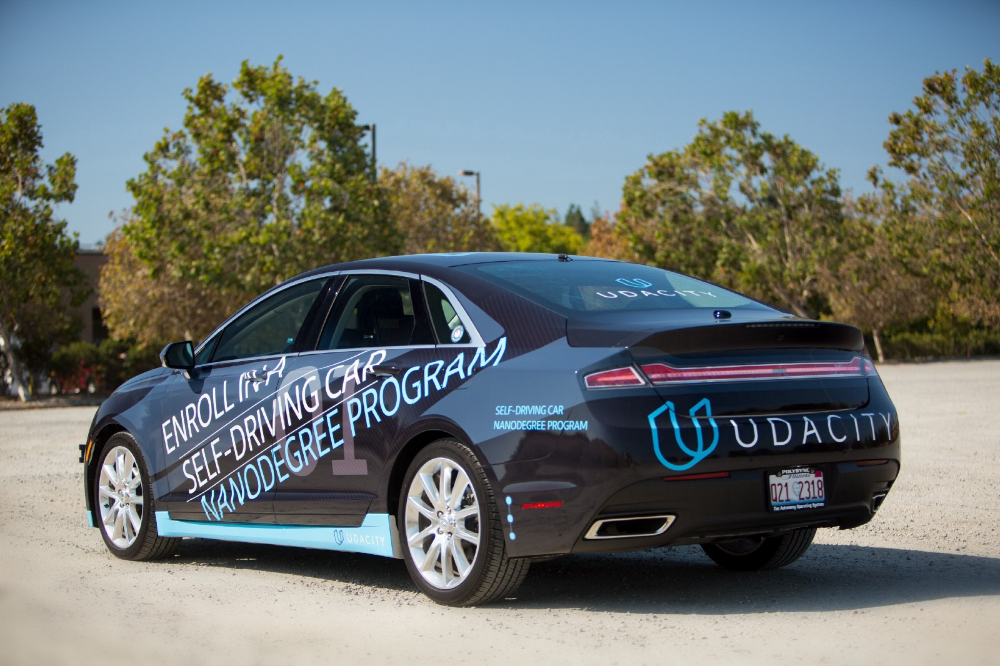


## Project objectives
The objective of this project is to implement ROS-based core of an autonomous vehicle. The vehicle shall be able to complete a closed-circuit test-track, detecting the traffic lights and stopping whenever required. The code will be evaluated in a Unity simulator and a real-world Lincoln MKZ. More details on the project can be found [here](https://classroom.udacity.com/nanodegrees/nd013/parts/6047fe34-d93c-4f50-8336-b70ef10cb4b2/modules/e1a23b06-329a-4684-a717-ad476f0d8dff/lessons/462c933d-9f24-42d3-8bdc-a08a5fc866e4/concepts/5ab4b122-83e6-436d-850f-9f4d26627fd9).

### Specifications
The car should:  

* Smoothly follow waypoints in the simulator.  
* Respect the target top speed set for the waypoints' twist.twist.linear.x in waypoint_loader.py. 
* Stop at traffic lights when needed.
* Stop and restart PID controllers depending on the state of /vehicle/dbw_enabled.
* Publish throttle, steering, and brake commands at 50hz.


## Team

| 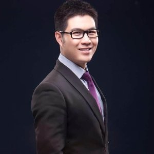  | 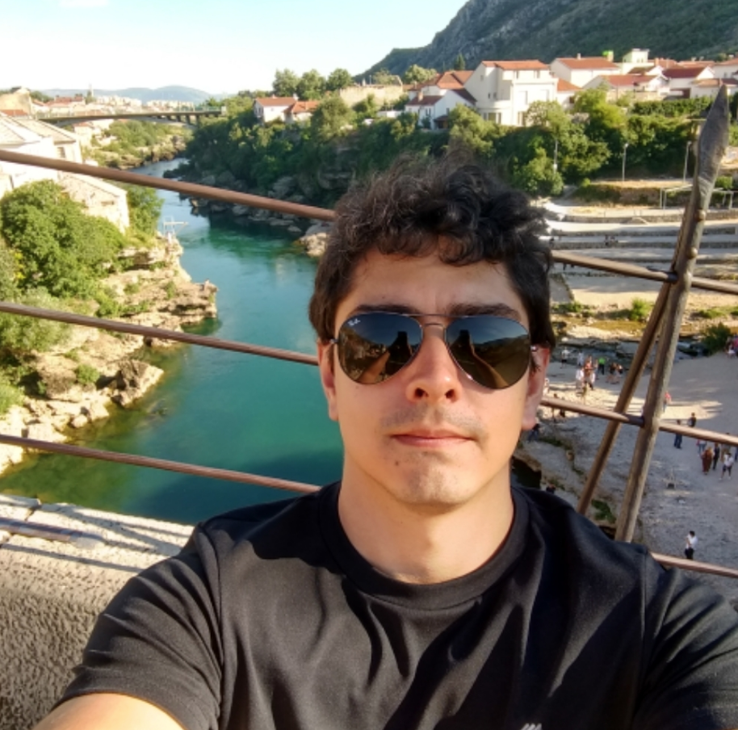  |   | |
|:---:|:---:|:---:|:---:|
| Jun Zhang, Team Lead, Senior Computer Vision Engineer at Aeryon Labs Inc, based in Waterloo, in Canada| André Bonatto, Credit Portfolio Specialist at Itaú Unibanco SA, based in São Paulo, Brazil |April Blaylock, Vision Systems Architect at Aeryon Labs Inc, based in Waterloo, Canada | Fabian Hertwig, Senior Data Scientist at MaibornWolff GmbH based in Munich, Germany |
|zjustc@gmail.com|andre.s.bonatto@gmail.com|april.deirdre@gmail.com|fabian.hertwig@gmail.com|


## ROS Architecture
The autonomous driving system is composed of perception, planning and control. The modules communicate according to the following ROS structure of nodes and topics : 


## Perception
We used two different deep learning models for the traffic light detection system. One is used in the simulator and the other on the test site. The obstacle detection system could be negleted. There are no obstacles either in the simulator nor on the test site.

Carla has a camera mounted on its windshield. The simulator has a digital counterpart.

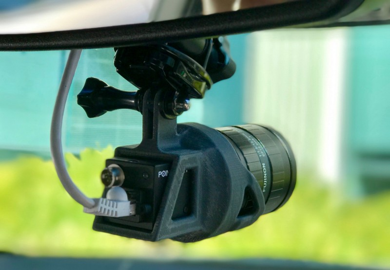


### Simulator

At first we collected images from the cars camera with the current traffic light state to generate a training data set. The current traffic light state was provided by the simulator, but of course should not be used for the perception system and is not available at the test site.

We collected about 7000 images with the traffic light states red, yellow, green or no visible traffic light.

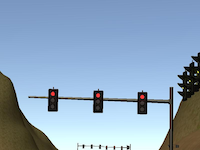  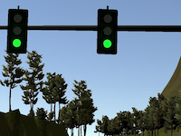 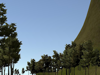

We used this dataset to train a [VGG16 network](https://arxiv.org/abs/1409.1556) with pretrained weights on the imagenet dataset. The network classifies the whole image whenever the car is near a traffic light. This network achieved a very good accuracy of 99.4% on test data from the same dataset.

### Site
For the traffic light detection in the real world, we designed a YOLOv2-MobileNet detector, where we replace the original backbone feature extraction networks of YOLOv2 to be MobileNet to speed up the inference performance. The implementaton of the detector can be found from here [MobileDet](https://github.com/darknight1900/MobileDet)

From most of the video other students shared online, the site test seems to always run in daytime so we only use 'daySequence1' and 'daySequence2' total 7000 images to train the detector. The training process is done with below 3 steps. 

#### 1. [LISA Traffic Light Dataset ](https://www.kaggle.com/mbornoe/lisa-traffic-light-dataset)
The weights of MobileNet are initialized with the ImageNet weights and then we train the YOLOv2-MobileNet with about 200 epoches. After this stage, the detector could detect the test images from LISA dataset quite well. 

#### 2. [Udacity Parking Lot Dataset](https://github.com/coldKnight/TrafficLight_Detection-TensorFlowAPI#get-the-dataset)
There is a labelled UDacity parking lot dataset which has around 200 images, we fine tune the detector for this dataset for another 50 epochs and after that the detector can more or less detect the traffic lights, however there is lots of missing and false detection after this stage. Here is some examples. It is interesting to see from those two images that the detector is confused by the red color leaves of by the reflections. One of the reason that the poor detection performance is due to missing training data as only 200 training images are used.
<figure>
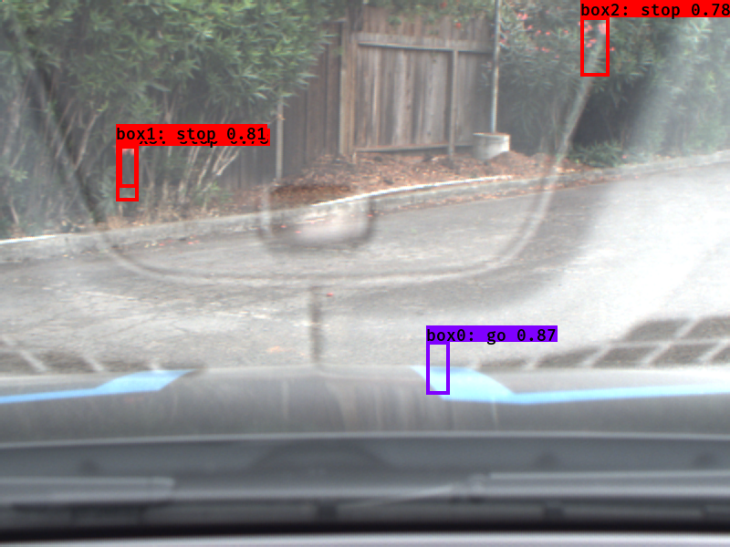
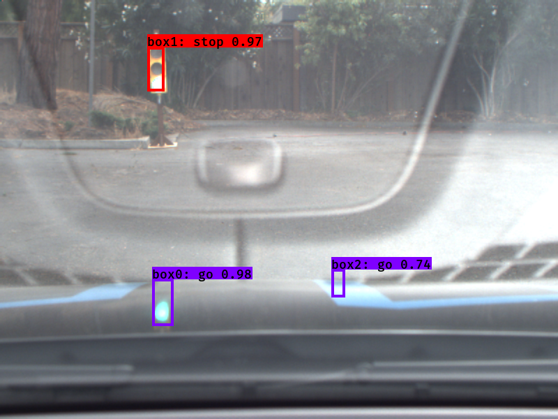
</figure>

#### 3. Hard Negative Training 
To address above issue, we log all the detection results and image file names to the csv file and manually update the labels so that all the false detection bounding boxes will be served as negative samples and we further train the detector for another 10 epochs. From below example images, we can see that in the spot the detector previously confused, it now can correctly know that this is not a traffic light but just a reflection. Note, the 'donotcare' label is the negative training label. 
<figure>
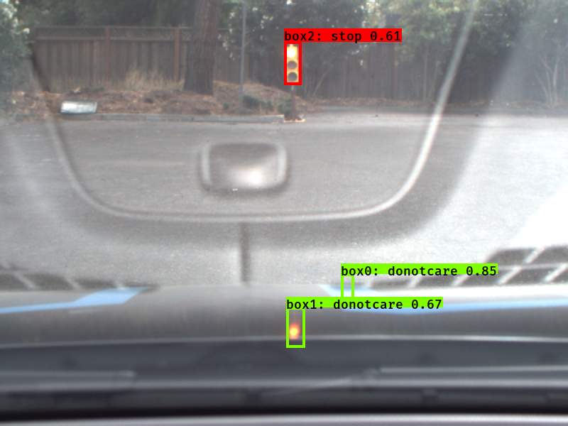
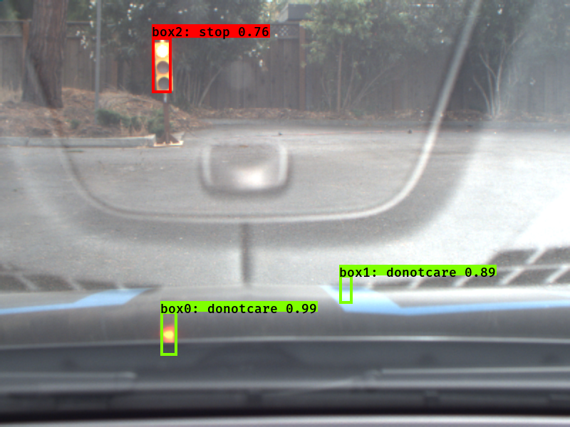
</figure>
However, once a while the detector might still confuse a red leave with red lights. 
<figure>
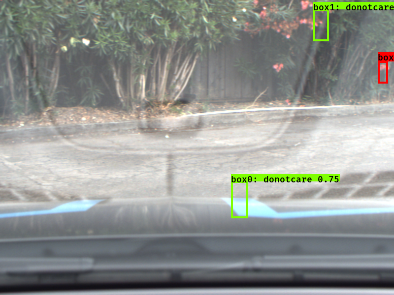
</figure>

#### 4. Test with site rosbag video
Below is the results we test against UDacity parking lot images. 

[Youtube video](https://youtu.be/c4S1ngv-dPo)
## Planning

The objective of the planning module is to specify target speeds based on mission requirements, road map and scene obstacles. In this project the goal is to keep the center lane, respect the speed limit and stop in the red traffic lights. 

The waypoint planner incorporates the information from the traffic light detection node and the base waypoints and the car's pose to form a final waypoint trajectory. The final trajectory is a list of waypoints with target velocities for the car to follow in the control block. 

If any traffic lights are detected the traffic_cb will contain a valid stop line waypoint in front of the vehicle.  If this stopline is within the lookahead distance, a geometric deceleration trajectory is calculated that is ensured not to exceed the maximum accelleration and jerk contraints. If no red traffic lights are detected the planner will simply return the base waypoints to follow within the speed limit.

## Control

Per requirements, the control module must publish throttle, steering angle and brake torque at 50 Hz. To accomplish this, an  yaw controller provides the steering angle that matches the target linear and angular speeds, taking into account the current linear speed of the vehicle.

The linear speed of the vehicle is controlled with a classic digital PID controller. To avoid any kind of aliasing, the speed tracking error is filtered with a single pole low-pass filter and then fed to the controller.

The controller signal is limited to the vehicle acceleration and deceleration limits. If the control command signals acceleration,the value is sent to the throttle as is. To avoid braking overuse and excessive jerk, the control is configured to first stop sending throttle signals and start actively braking the car only if the required force exceeds the brake deadband. Due to the asymptotic nature of PID control, we need to force a full stop with the parking torque of 700 N.m whenever the speed of vehicle falls below a threshold.

Since the reference signal is relatively smooth, an automatic tuning process was not needed. The manual tuning started with adjusting the proportional gains and comparing it against the first seconds of the reference implementation. The other two components were adjusted with a manual process of minimizing the root mean squared error between the reference implementation and the output. The final result of this process in shown in [Drive-by-wire testing](#Drive-by-wire-testing)

## Build Instructions 

Please use **one** of the two installation options, either native **or** docker installation.

### Native Installation

* Be sure that your workstation is running Ubuntu 16.04 Xenial Xerus or Ubuntu 14.04 Trusty Tahir. [Ubuntu downloads can be found here](https://www.ubuntu.com/download/desktop).
* If using a Virtual Machine to install Ubuntu, use the following configuration as minimum:
  * 2 CPU
  * 2 GB system memory
  * 25 GB of free hard drive space

  The Udacity provided virtual machine has ROS and Dataspeed DBW already installed, so you can skip the next two steps if you are using this.

* Follow these instructions to install ROS
  * [ROS Kinetic](http://wiki.ros.org/kinetic/Installation/Ubuntu) if you have Ubuntu 16.04.
  * [ROS Indigo](http://wiki.ros.org/indigo/Installation/Ubuntu) if you have Ubuntu 14.04.
* [Dataspeed DBW](https://bitbucket.org/DataspeedInc/dbw_mkz_ros)
  * Use this option to install the SDK on a workstation that already has ROS installed: [One Line SDK Install (binary)](https://bitbucket.org/DataspeedInc/dbw_mkz_ros/src/81e63fcc335d7b64139d7482017d6a97b405e250/ROS_SETUP.md?fileviewer=file-view-default)
* Download the [Udacity Simulator](https://github.com/udacity/CarND-Capstone/releases).

### Docker Installation
[Install Docker](https://docs.docker.com/engine/installation/)

Build the docker container
```bash
docker build . -t capstone
```

Run the docker file
```bash
docker run -p 4567:4567 -v $PWD:/capstone -v /tmp/log:/root/.ros/ --rm -it capstone
```

### Port Forwarding
To set up port forwarding, please refer to the [instructions from term 2](https://classroom.udacity.com/nanodegrees/nd013/parts/40f38239-66b6-46ec-ae68-03afd8a601c8/modules/0949fca6-b379-42af-a919-ee50aa304e6a/lessons/f758c44c-5e40-4e01-93b5-1a82aa4e044f/concepts/16cf4a78-4fc7-49e1-8621-3450ca938b77)

### Usage

1. Clone the project repository
```bash
git clone https://github.com/udacity/CarND-Capstone.git
```

2. Install python dependencies
```bash
cd CarND-Capstone
pip install -r requirements.txt
```
3. Make and run styx
```bash
cd ros
catkin_make
source devel/setup.sh
roslaunch launch/styx.launch
```
4. Run the simulator

## Testing the implementation

### Drive-by-wire testing
1. Download the [dbw bag](https://drive.google.com/open?id=1utQo2NRsFZr9mjTw6H7w0DMCB-g3xoTc)
2. Unzip the file to CarND-Capstone/ros and rename it to dbw_test.rosbag.bag
3. source ros/devel/setup.sh
4. roslaunch ros/src/twist_controller/launch/dbw_test.launch

This will produce the files brakes.csv, steers.csv and throttles.csv, comparing the reference command with the current implementation.

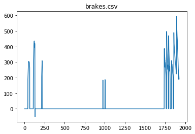

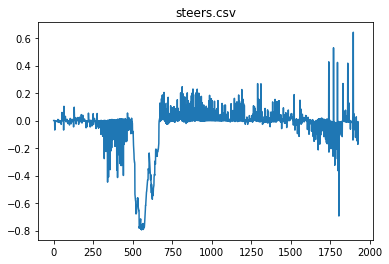

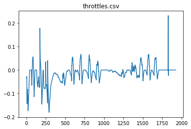

### Traffic light detection with real world images
1. Download [training bag](https://drive.google.com/file/d/0B2_h37bMVw3iT0ZEdlF4N01QbHc) that was recorded on the Udacity self-driving car.
2. Unzip the file
```bash
unzip traffic_light_bag_file.zip
```
3. Play the bag file
```bash
rosbag play -l udacity_succesful_light_detection.bag
```
4. Launch your project in site mode
```bash
cd CarND-Capstone/ros
roslaunch launch/site.launch
```
5. Confirm that traffic light detection works on real life images
